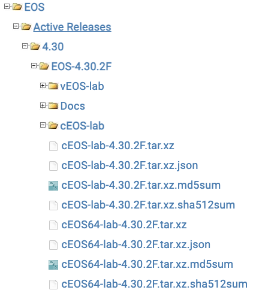
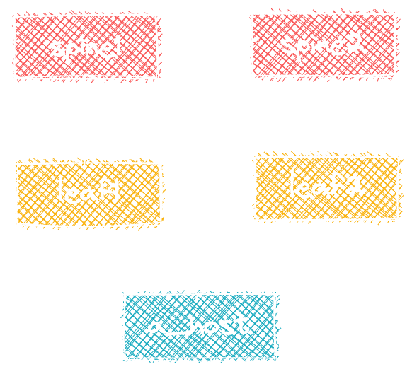

# Workshop

## Building Containerlab with cEOS-lab

<!-- Do not add page number on this slide -->
<!--
_paginate: false
-->

```text
How to build a lab environment
with Containerlab and cEOS-lab

Petr Ankudinov, 2023
```


---

# Credits and References

<style scoped>section {font-size: 22px;}</style>

<!-- Add footer starting from this slide -->
<!--
footer: 'cEOS/cLab Workshop 2023'
-->

> Credits to [Roman Dodin](https://netdevops.me/) and [other cLab contributors](https://github.com/srl-labs/containerlab/graphs/contributors) for making the world a better place!

This repository is based on many awesome open source repositories and some free/commercial Github features:

- [Containerlab](https://containerlab.srlinux.dev/)
- [VS Code](https://code.visualstudio.com/)
- [DevContainers](https://code.visualstudio.com/docs/remote/containers)
- [Marp](https://marp.app/)
- [Excalidraw VS Code Plugin](https://github.com/excalidraw/excalidraw-vscode)
- [Github Actions](https://github.com/features/actions)
- [Github Pages](https://pages.github.com/)
- [Github Codespaces](https://github.com/features/codespaces)
- [Carbon](https://carbon.now.sh/)
- And many more...

All photos are taken from [Pexels](https://www.pexels.com/) and [Unsplash](https://unsplash.com/). Excellent free stock photos resources. It's not possible to reference every author individually, but their work is highly appreciated.

---

# Agenda

<style scoped>section {font-size: 20px;}</style>


- Setup Docker on the host
- Install Containerlab and import cEOS-lab image
- Clone this repository and deploy the lab
- Inspect and destroy the lab
- Deploy the lab with a custom startup config
- Make a packet capture
- cLab in a Container
- Possible caveats

> This workshop is a step-by-step guide explaining how to build a lab environment with [Containerlab](https://containerlab.srlinux.dev/) and Arista cEOS-lab. It is  focusing on essential and cEOS-lab specific features. Please check [Containerlab documentation](https://containerlab.srlinux.dev/) for details.

---

# Prerequisites

- This workshop requires:
  - Ubuntu LTS 22.04 or later
  - 8 GB RAM and 4 vCPUs
- Only x86 architecture is supported. It is technically possible to [run Container lab on ARM](https://containerlab.dev/install/#containerlab-on-arm-based-macs), but there are no network images available for ARM as of Aug 2023.
- You can use [Github Codespaces](https://github.com/features/codespaces) or [VSCode devcontainer](https://code.visualstudio.com/docs/devcontainers/containers) for this workshop. The detailed procedure is described in the appendix.
- The appendix also provides instructions for creating a KVM VM with Ubuntu Cloud Image.
- There is also Vagrant file available in this repository. Use it at your own risk.

---

# Setup Docker on the Host

<style scoped>section {font-size: 22px;}</style>

<div class="columns">
<div>

> Check if Docker is already installed. In this case you can skip the steps below.

1. Install Docker on the host. The detailed instructions are available [here](https://docs.docker.com/engine/install/ubuntu/). You can used one-liner script for that.
2. Add your user to the `docker` group.
3. Logout and login again to apply the changes.
4. Check the Docker version and run `hello-world` container to test functionality.

</div>
<div>

```bash
# install Docker
sudo curl -fsSL https://get.docker.com | sh
# add user to the docker group
sudo usermod -aG docker ${USER}
# test docker
docker --version
docker run hello-world
```

</div>
</div>

---

# Setup Git (Optional)

<style scoped>section {font-size: 20px;}</style>

- Git must be pre-installed. Otherwise you are in a wrong place. Escape! 👾 🚀
- Setup your name and email address:

  ```bash
  git config --global user.name "<first-and-2nd-name>"
  git config --global user.email "<your-email>"
  ```

- Check the current configuration:

  ```bash
  git config --list
  ```

---

# Clone this Repository

```console
$ cd ${HOME}
$ git clone https://github.com/arista-netdevops-community/building-containerlab-with-ceos.git
Cloning into 'building-containerlab-with-ceos'...
remote: Enumerating objects: 198, done.
remote: Counting objects: 100% (198/198), done.
remote: Compressing objects: 100% (120/120), done.
remote: Total 198 (delta 109), reused 152 (delta 66), pack-reused 0
Receiving objects: 100% (198/198), 1.31 MiB | 6.59 MiB/s, done.
Resolving deltas: 100% (109/109), done.
$ ls | grep ceos
building-containerlab-with-ceos
$ cd building-containerlab-with-ceos
```

---

# Download cEOS-lab Image

<style scoped>section {font-size: 20px;}</style>

1. Login to [Arista Software Download](https://www.arista.com/en/support/software-download) portal. You need to have an account to download the image.
2. Select `EOS > Active Releases > 4.30 > EOS-4.30.2F > cEOS-lab`.
3. Download `cEOS-lab-4.30.2F.tar.xz` image.
4. Upload the image to your lab VM. For example, you can use SFTP to transfer the image:

  ```bash
  sftp ${REMOTE_USER}@${UBUNTU_VM_IP}:/home/${REMOTE_USER}/${IMAGE_DIR} <<< $'put cEOS-lab-4.30.2F.tar*'
  # for example:
  # sftp user@10.10.10.11:/home/user/images <<< $'put cEOS-lab-4.30.2F.tar*'
  ```

> NOTE: if you are using Vagrant, add the image to `.gitignored` directory. It will be automatically copied to the VM.
> If Github Codespace is used and token is set, the image will be pulled from arista.com automatically.



---

# Import cEOS-lab Image

<style scoped>section {font-size: 22px;}</style>

1. Go to the directory with the uploaded image and import the image:

    ```bash
    docker import cEOS-lab-4.30.2F.tar.xz ceos-lab:4.30.2F
    ```

    > NOTE: you can also import the image with the tag latest to allow quick "upgrade" of those lab where specific version is not required: `docker tag ceos-lab:4.30.2F ceos-lab:latest`

2. Confirm that the image was imported successfully:

    ```console
    $ docker image ls
    REPOSITORY    TAG       IMAGE ID       CREATED          SIZE
    ceos-lab      4.30.2F   21b540a4a343   45 minutes ago   1.95GB
    ceos-lab      latest    21b540a4a343   45 minutes ago   1.95GB
    hello-world   latest    b038788ddb22   3 months ago     9.14kB
    ```

---

# Install Containerlab

<style scoped>section {font-size: 22px;}</style>

- It's just a one-liner:
  
  ```bash
  bash -c "$(curl -sL https://get.containerlab.dev)"
  ```

- Refer to the [Containerlab quick start documentation](https://containerlab.dev/quickstart/) for the details.

---

# Deploy The Lab

<style scoped>section {font-size: 20px;}</style>



- Inspect `default_cfg.clab.yml` and deploy the lab:

  ```bash
  sudo containerlab deploy --debug --topo default_cfg.clab.yml
  ```

- This command will deploy Containerlab with the default EOS configuration provided by Containerlab. The `--debug` flag is optional, but provides additional information while Containerlab is starting.

  > NOTE: If there is a single `.clab.yml` file in the current directory, it is possible to use `sudo containerlab deploy` command without specifying the topology file. As we have multiple files in the directory, we must specify the topology explicitly.

---

# Inspect the Lab - 1

<style scoped>section {font-size: 20px;}</style>

Once the lab is ready, you'll see a table with the list of deployed containers, their host names and management IPs:

```text
+---+----------------------+--------------+-----------------+------+---------+--------------------+--------------+
| # |         Name         | Container ID |      Image      | Kind |  State  |    IPv4 Address    | IPv6 Address |
+---+----------------------+--------------+-----------------+------+---------+--------------------+--------------+
| 1 | clab-ceos-lab-a_host | 421665f3e67f | ceos-lab:latest | ceos | running | 192.168.123.100/24 | N/A          |
| 2 | clab-ceos-lab-leaf1  | a7f7c80aa90f | ceos-lab:latest | ceos | running | 192.168.123.21/24  | N/A          |
| 3 | clab-ceos-lab-leaf2  | 142ab91f0ceb | ceos-lab:latest | ceos | running | 192.168.123.22/24  | N/A          |
| 4 | clab-ceos-lab-spine1 | 22464060dcf8 | ceos-lab:latest | ceos | running | 192.168.123.11/24  | N/A          |
| 5 | clab-ceos-lab-spine2 | 3f53d1de7add | ceos-lab:latest | ceos | running | 192.168.123.12/24  | N/A          |
+---+----------------------+--------------+-----------------+------+---------+--------------------+--------------+
```

> You can call the table again any time with `sudo clab inspect -t default_cfg.clab.yml`.

Containerlab creates corresponding entries in the `/etc/hosts` file as well:

```bash
$ cat /etc/hosts | grep -i clab-
###### CLAB-ceos-lab-START ######
192.168.123.22  clab-ceos-lab-leaf2
192.168.123.11  clab-ceos-lab-spine1
192.168.123.12  clab-ceos-lab-spine2
192.168.123.100 clab-ceos-lab-a_host
192.168.123.21  clab-ceos-lab-leaf1
###### CLAB-ceos-lab-END ######
```

---

# Inspect the Lab - 2

You can also list containers using docker command:

```console
$ docker container ls
CONTAINER ID   IMAGE             COMMAND                  CREATED         STATUS         PORTS     NAMES
22464060dcf8   ceos-lab:latest   "bash -c '/mnt/flash…"   5 minutes ago   Up 5 minutes             clab-ceos-lab-spine1
3f53d1de7add   ceos-lab:latest   "bash -c '/mnt/flash…"   5 minutes ago   Up 5 minutes             clab-ceos-lab-spine2
a7f7c80aa90f   ceos-lab:latest   "bash -c '/mnt/flash…"   5 minutes ago   Up 5 minutes             clab-ceos-lab-leaf1
421665f3e67f   ceos-lab:latest   "bash -c '/mnt/flash…"   5 minutes ago   Up 5 minutes             clab-ceos-lab-a_host
142ab91f0ceb   ceos-lab:latest   "bash -c '/mnt/flash…"   5 minutes ago   Up 5 minutes             clab-ceos-lab-leaf2
```